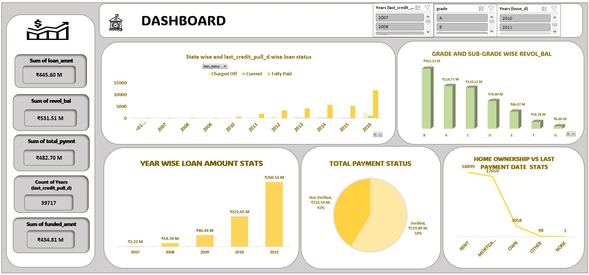
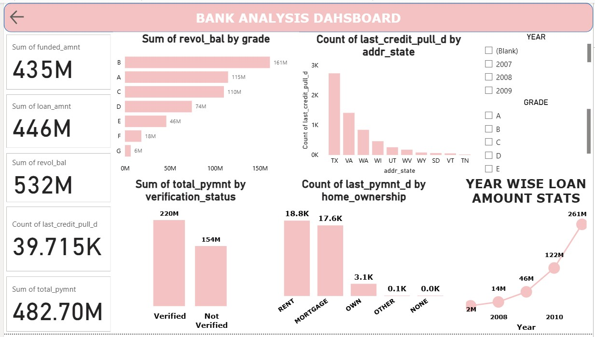
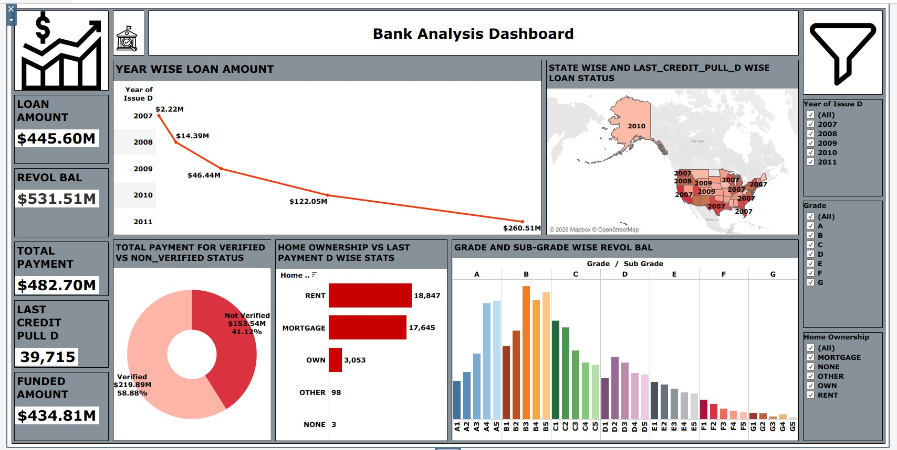

#  Data Analysis Portfolio Project

##  Project Story
In today’s data-driven world, businesses rely on insights to make informed decisions.  
In this project, I analyzed a dataset using multiple tools (Excel, SQL, Power BI, and Tableau) to uncover trends, patterns, and actionable insights.

This project reflects my ability to work across the complete data analysis pipeline — from data extraction to visualization.

---

##  Problem Statement
Raw data is often unstructured and difficult to interpret.  
The goal of this project was to:
- Clean and transform raw data  
- Analyze it using SQL  
- Build interactive dashboards  
- Generate insights for decision-making  

---

##  Tools & Technologies
-  Microsoft Excel (Data Cleaning & Dashboard)
-  SQL / MySQL (Data Analysis)
-  Power BI (Interactive Dashboard)
-  Tableau (Data Visualization)

---

##  Dashboard Previews

###  Excel Dashboard

###  Power BI Dashboard

###  Tableau Dashboard

---

##  Key Insights
- Identified patterns and trends in the dataset  
- Created visually appealing dashboards for better understanding  
- Simplified complex data into easy-to-understand visuals  
- Improved decision-making through data insights  

---

##  What I Learned
- Data cleaning and preprocessing techniques  
- Writing efficient SQL queries for analysis  
- Building dashboards in Power BI and Tableau  
- Presenting insights in a clear and impactful way  

---

##  Project Highlights
Multi-tool data analysis (Excel + SQL + Power BI + Tableau)  
End-to-end data workflow  
Business-focused insights  
Dashboard-driven storytelling  

---

## 👤 About Me
**Aaysha Khan**  
Aspiring Data Analyst with skills in Excel, SQL, Python, Power BI, and Tableau  
Open to Data Analyst opportunities  

---

⭐ If you like this project, feel free to give it a star!
